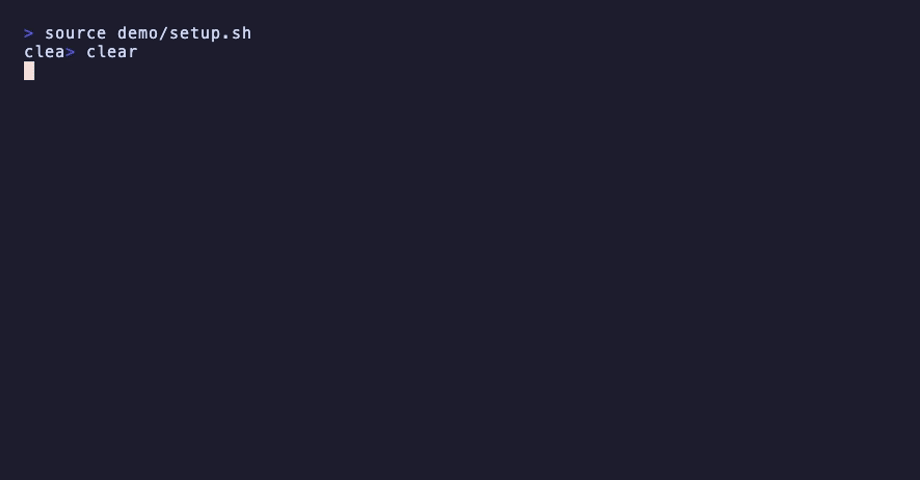

```
             █████╗ ████████╗
            ██╔══██╗╚══██╔══╝
            ███████║   ██║
            ██╔══██║   ██║
            ██║  ██║   ██║
            ╚═╝  ╚═╝   ╚═╝
── A   S H E L L - N A T I V E   A I ──
```

# @ — your shell is the AI interface

`@` turns AI coding agents into a shell command. No app to launch, no interactive mode to enter and leave — you stay in your terminal and talk to the agent the same way you run `git` or `pytest`:

<p align="center">
  
</p>

Each call streams the agent's work and drops you straight back at your prompt. The conversation carries over between calls, so the agent remembers everything you've discussed in this project.

Under the hood, `@` drives your choice of **Codex CLI**, **Claude Code**, or **opencode** — one wrapper, one muscle memory, whichever agent you prefer today.

## Why it's more than a shortcut

**Pipes just work.** Anything you can put in a pipe becomes context for the agent:

```sh
git diff | @ "review this change"
pytest 2>&1 | @ "why is this failing"
kubectl logs api-7d4b | @ "what went wrong here"
```

**Conversations persist per project.** Each repo (or directory) gets its own thread per backend. Ask a follow-up tomorrow and the agent still knows what you were doing. When one thread isn't enough, name them and jump between parallel workstreams:

```sh
@ --save auth-bug          # name the current conversation
@ --new                    # start a clean one for something else
@ --switch auth-bug        # pick up right where you left off
@ --list                   # see everything you've saved
```

**It scripts like a Unix tool.** Quiet mode (`-q`) drops the spinner and the tool echo; stdout carries nothing but the answer, so `@` composes with everything else:

```sh
# commit with a generated message
git commit -m "$(git diff --cached | @ -q 'one-line commit message for this change')"

# nightly log triage from cron
grep ERROR app.log | @ -q "summarize these errors, worst first" >> report.md
```

Errors still arrive on stderr, and the exit code is the backend's — so `&&` chains and `set -e` behave.

**Your shell stays yours.** `@` never wraps or emulates your shell. Between agent calls you run ordinary commands, inspect what the agent did with `git diff`, and steer with the next `@`. Prompts are never mistaken for commands — only `--` prefixed words are commands, so `@ save this data to a file` goes to the agent, untouched.

**It's inspectable.** The whole thing is a single Python file with no dependencies beyond the standard library. You can read every line of what sits between you and your agent.

## Install

```sh
curl -fsSL https://raw.githubusercontent.com/FreHilm/at/main/install-at-agent.sh | sh
```

Or with `wget`:

```sh
wget -qO- https://raw.githubusercontent.com/FreHilm/at/main/install-at-agent.sh | sh
```

The installer checks that `python3` is available, downloads `@` to `~/.local/bin/@`, and tells you exactly what to add if that directory isn't on your `PATH`. From a cloned repo, `./install-at-agent.sh` installs the local copy instead.

You'll also need at least one backend CLI installed and authenticated:

| Backend | Command | |
|---|---|---|
| [Claude Code](https://claude.com/claude-code) | `claude` | default |
| [Codex CLI](https://github.com/openai/codex) | `codex` | |
| [opencode](https://opencode.ai) | `opencode` | |

Requirements: `python3`, macOS or Linux. `git` is optional — it's used to find the project root, but `@` works fine outside repositories too.

## Commands

```text
@ <instruction>       Ask the agent to work in the current repo/directory
@ -q <instruction>    Quiet: no spinner, no tool echo — answer only
@ --use <backend>     Choose backend for this repo: codex, claude or opencode
@ --default [backend] Show or set your default backend (all repos)
@ --on <backend> <instruction>   One-shot prompt on another backend
@ --new               Start a fresh conversation for this repo
@ --save <name>       Name the current conversation
@ --switch <name>     Switch to a named conversation
@ --list              List named conversations for this repo
@ --forget [name]     Forget the current conversation (or a named one)
@ --status            Show the repo, backend, and saved conversations
@ --color [name]      Show or set the spinner color (or 'random')
@ --spinner-test [x] [color]  Test the thinking animation
@ --version           Show the installed version
@ --update            Update @ to the latest version
@ --completion <sh>   Print completion script for zsh or bash
@ --help              Show help
```

### Tab completion

```sh
# zsh (~/.zshrc)
eval "$(@ --completion zsh)"

# bash (~/.bashrc)
eval "$(@ --completion bash)"
```

Completes the commands, backend names, spinner styles — and your saved conversation names for `--switch` and `--forget`.

### Choosing a backend

The backend is resolved per project, in this order:

1. `@ --use codex|claude|opencode` (saved for the repo)
2. The `AT_AGENT_BACKEND` environment variable
3. Your global choice: `@ --default codex|claude|opencode` (saved in `~/.at/config.json`)
4. `claude` — or, if claude isn't installed, whichever backend is

That last step means a fresh install just works: if you only have one of the backends on your machine, `@` finds and uses it without any setup.

Each backend keeps its own conversation, so switching never loses the other's thread:

```sh
@ --use claude
@ say hello
@ --use codex        # the Claude session is still saved
@ --status
```

For a single prompt on another backend — say, a second opinion — use `--on`, which leaves the repo's saved choice untouched:

```sh
git diff | @ --on claude "review this change"
```

Or make it muscle memory with backend-pinned symlinks: invoked as `@x`, `@c`, or `@o`, the same script pins codex, claude, or opencode for that call:

```sh
ln -s ~/.local/bin/@ ~/.local/bin/@c
@c what do you think of this approach
```

## What output looks like

Agent replies print plainly to stdout — no banners, no framing. While the agent thinks, a small spinner runs on the terminal (and never leaks into redirected or piped output), typing out a mood word beside it — `⠋ Pondering` — which it backspaces away and replaces every few seconds. Each run picks a random style and color, gently pulsing — pin a color with `@ --color teal`, go back with `@ --color random`, and preview with `@ --spinner-test`. It respects `NO_COLOR`. Commands the agent executes are echoed compactly to stderr with their output beneath:

```text
  $ pytest
  ...
```

Other tool activity (file reads, searches) shows as a short `[Name target]` note instead of flooding your terminal. Because replies go to stdout and everything else to stderr, you can pipe `@`'s answer onward like any other command. Ctrl-C stops the agent cleanly — the conversation is saved, ask again to continue.

## State and privacy

State lives in `${XDG_STATE_HOME:-~/.local/state}/at-agent/` — one small JSON file per project holding only what's needed to resume: the chosen backend and conversation IDs. No prompts, no command output, no repository content is ever stored.

`@` also doesn't touch your agents' safety settings: it passes no permission-widening flags (like `--dangerously-skip-permissions`), so whatever approval and sandboxing behavior your backend has remains in effect.

## License

MIT — see [LICENSE](LICENSE). [ATTRIBUTIONS.md](ATTRIBUTIONS.md).
